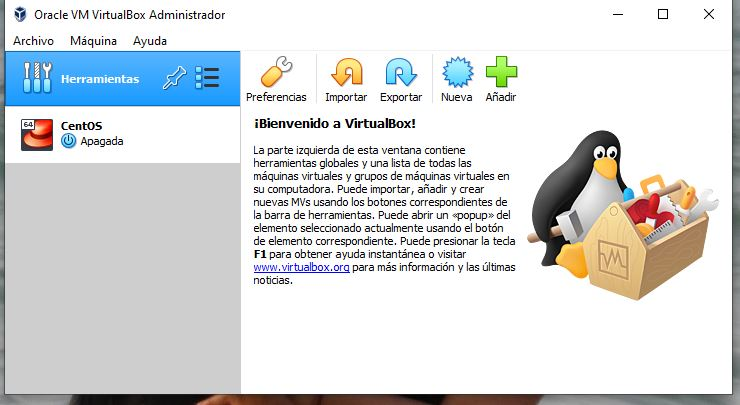
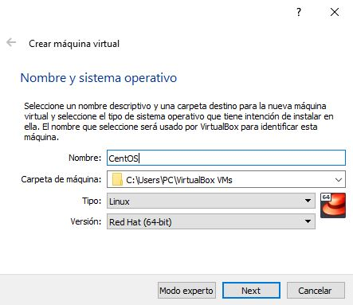
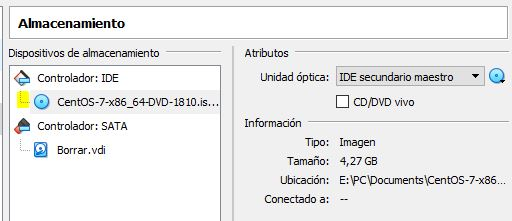
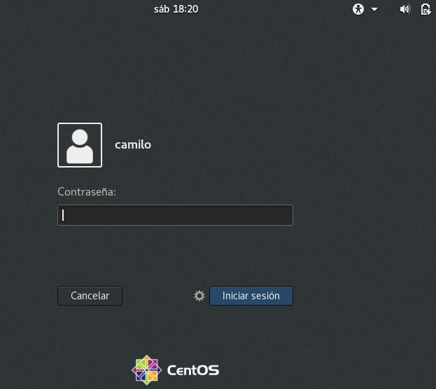
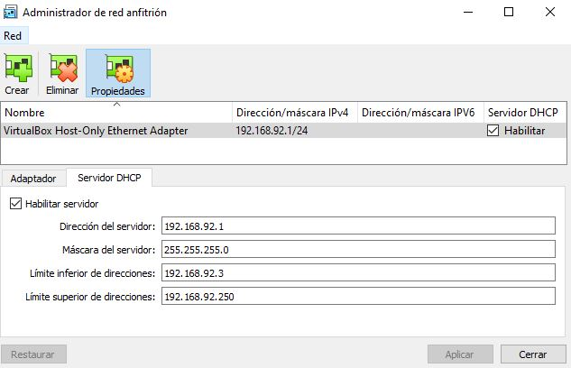
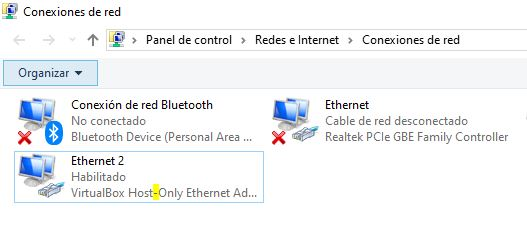
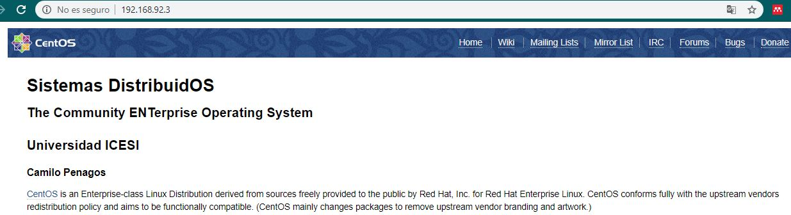

# Escenario UNO

Solución primer laboratorio del curso  **Sistema Distribuidos**

**Camilo Penagos Orejuela**

**A00301416**

## Proceso

 1. **VirtualBox:** El proceso de instalación de virtual box es bastante sencillo, basta con buscar en el navegador, el sitio web oficial de descargar de virtual box y seleccionar el paquete de la plataforma correspondiente. En mi caso descargo el paquete de un **host windows**. Virtual box es un hipervisor liviano, que se instala rápidamente y no presenta dificultades en el proceso de instalación.
 
      

2. **CentOS:** El paso siguiente es descargar una maquina virtual CentOS que sea soportada por el hipervisor VirtalBox, para hacer la respectiva instalación de la misma, en este caso la imagen ISO corresponde a **CentOS7**. 
- El primer paso es crear la maquina virtual en VirtualBox

    
    
- Despues se configuran las caracterisitcas de hardware virtual de la maquina, memoria RAM, espacio de disco y  tarjeta de red

- Luego de debe asignar el **controlador** de IDE, que corresponde a la imagen ISO de CentOS7, de esta manera VirtaulBox procede con el boot inicial para crear instalar la maquina virtual 

    
    
 - Posteriormente se debe proceder con la configuracion incial del sistema operativo CentOS, donde se establecen las preferencias de idioma, entrada de texto y el tipo de instalación, en este caso la opcion es **servidor con GUI**, de manera que el sistema operativo tenga una interfaz de usuario y reconozca los comandos de administración e instalación de servicios. El proceso de inslación tarda mas de 30 minutos en completarse correctamente.
 
- Finalmente se configuran el usuario de la maquina virtual y el usuario root para administracion.

- De esta manera tendremos una maquina virtual CentOS7 totalmente configurada y lista para usar.

    

3. **Nginx:** El proceso de descarga e instalacion del servidor Nginx no resulta muy complejo, para instalar este servicio en la maquina virtual se debe ejecutar los siguientes comandos, para ello se deben tener permisos de super usuario o root en la maquina.

`sudo yum install epel-release`

Bajar el repositorio 

`sudo yum install nginx`

Bajar el servicio Nginx

`sudo systemctl start nginx`

Iniciar el servidor web en la maquina

`sudo systemctl enable nginx`

Habilitar el servicio en el sistema

`sudo firewall-cmd --permanent --zone=public --add-service=http` 

`sudo firewall-cmd --permanent --zone=public --add-service=https`

`sudo firewall-cmd --reload`

Habilitar el trafico web(http) y web seguro (https) en el firewall de la maquina virtual

- De esta manera se tiene un servidor web configurado

4. **Acceso y red host only:** Para acceder al servidor web(maquina CentOS7) desde el host principal, se procede crear una red **host only**

- Para ello se debe crear un adaptador de red virtual en el *host*. Esto se hace en virtual box, en la pestaña preferencias se crea un nuevo adaptador de red y ademas se configura un servidor **DHCP** para la asignación dinamica de direcciones IP.

- Luego de debe configurar la preferencia de red para el guest, de manera que se concecte a la red host only. Se espera que al conectarse a la red, obtenga una direccion **IP** otorgada por el servidor DHCP configurado anteriormente.

- Se verifica que el host Windows, tenga un adaptador de red virtual para conectarse a la red host only

- Por ultimo accedemos desde el host al servidor web alojado en la maquina CentOS7 usando **http://192.168.92.3** y se despliega el index del servidor.

## Dificultades

## Reflexión

