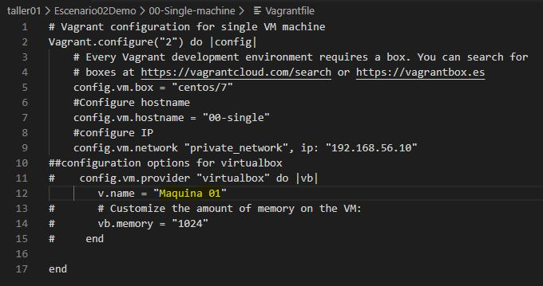
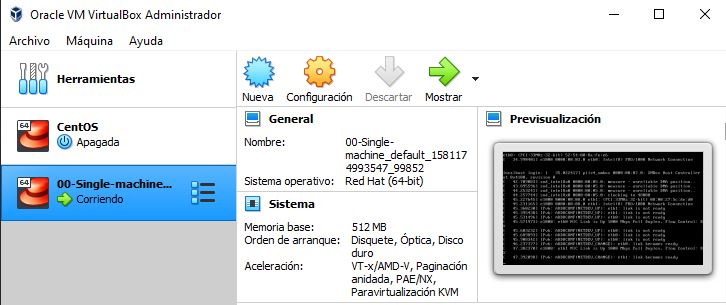
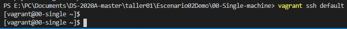
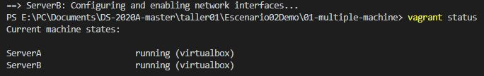
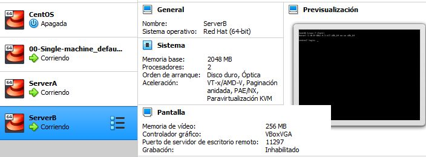

# Escenario 02 

Solución del segundo taller **Sistemas Distribuidos**

## Proceso

1. **Maquina Virtual CentOS7:** Para crear la primera maquina virtual con Vagran, es necesario usar la consola de Visual Studio Code. Se unica la ruta (path) del archivo Vagranfile y mediante el comando **vagrant up** se hace efectiva la instalación de la MV en Virtual Box, usando como proovedor Vagrant

- Este es el archivo vagrant file de configuraicon inicial para nuestra maquina virtual CentOS7

  
  
- Se hace efectiva la creación de la maquina con el comando vagrant up

  
  
- Por ultimo se verifica que la maquina, efectivamente se ha creado y se puede acceder en Virtual Box

2. **Acceder por SSH:** Despues de crear la MV, accedemos a ella de manera remota, para poder hacer gestion o tener acceso a la consola. Esto se logra mediante SSH y se hace efectivo con el comando **vagran ssh default** en la consola de Visual, depues de ello se veficia que ya tenemos acceso a la consola de la maquina virtual que hemos creado anteriormente.   

3. **Crear dos servidores:** El siguiente paso es crear dos servidores virtuales, usando la herramienta Vagrant, que permite automatizar el proceso, y mediante un script crear las dos maquinas virtuales, con su configuración inicial. Para ello es necesario un archivo Vagrant file que se ejecute en la consola de Visual.

- Este es el archivo vagrant file de configuracion inicial, para la creacion de los dos servidores.

- Con el comando **vagrant status** , se evidencia que los dos servidoreshan sido creados y se encuentran corriendo.

- Igualmente se puede evidenciar que las maquinas efectivamente han sido creadas en Virtual Box

4. **Aprovisionamiento de los servidores:** Utilizando Ansible se pueden aprovisionar las maquinas virtuales de manera automatizada mendiante scripts que permiten hacer la gestion de las aplicaciones o servidios que se instalan en las maquinas.

